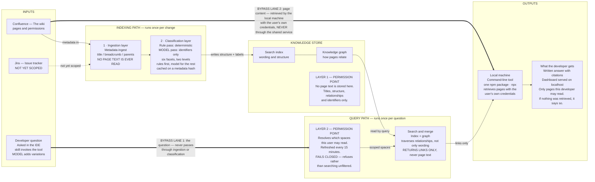
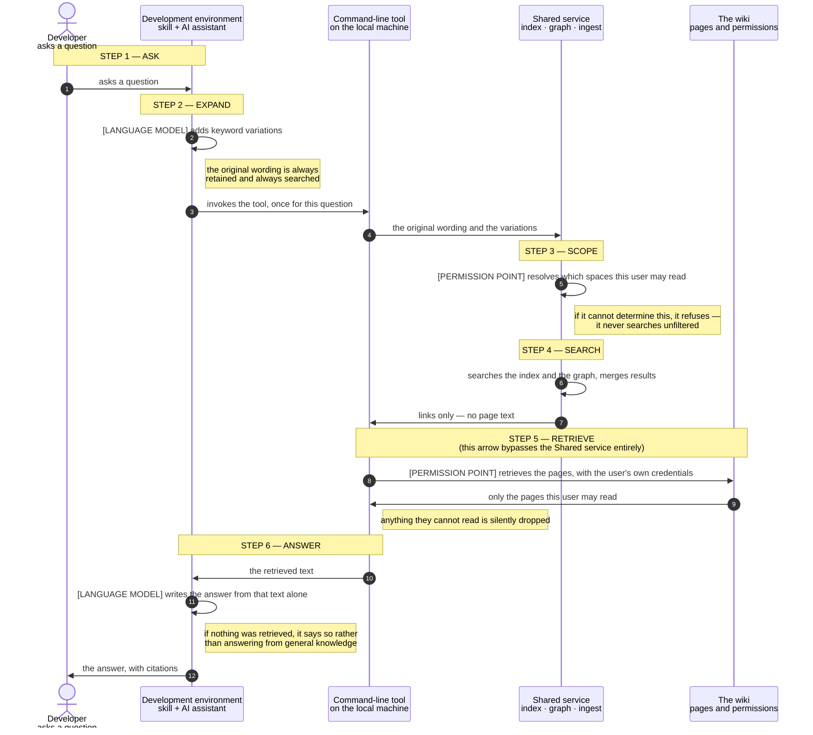

# HSBC Knowledge Base Service — Solution Design

> **Accessible conversion.** This is a machine-readable rendering of `HSBC-KB.pdf` (12 pages)
> for an AI agent or LLM with no visual capability. All prose is preserved. The two figures were
> vector diagrams with no alt text; each has been transcribed into Mermaid **plus** a written
> description of what the diagram asserts, because the Mermaid alone loses the colour-coding
> that carries meaning in the original.
>
> **Colour semantics in the source diagrams** (lost in plain text, load-bearing in the original):
> - **Brick red** — permission enforcement points. Used for nothing else.
> - **Olive green** — the language model. Appears exactly twice in Figure 1, never on the path to the index.
> - **Amber/gold** — metadata in, links out (the search path).
> - **Dark red** — page content moving under the user's own credentials.
> - **Grey dashed** — not yet scoped.

**Classification:** Internal · Solution Design

**One-line thesis:** A question-answering layer over the organisation's wiki, built so that no page
text is held centrally and no language model can influence what a person is allowed to read.

---

## 01 Summary

Developers cannot reliably find internal documentation. Current search matches wording, not
meaning, so a page that answers the question in different words is often not returned at all.

Measured on the prototype corpus, the correct page is the very first result for:

- **90%** of questions asked in the document's own wording
- **62%** when the question is paraphrased
- **23%** when the question is conceptual

The last figure is the problem: it covers exactly the questions asked by someone who does not
already know the document's vocabulary.

**The proposal.** A question-answering layer over the wiki. A developer asks a question in their
development environment and receives a written answer, with citations, drawn only from pages
they are permitted to read. A dashboard on their own machine shows how the answer was found.
Two capabilities are added to search:

1. a **knowledge graph**, so pages can be found through their relationships rather than only their wording
2. a **faceted classification layer**, a small human-owned vocabulary that lets content be narrowed and browsed

**The outcome.** Fewer questions that end in a dead end, answers that carry citations back to the
source page, and no relaxation of existing access control anywhere in the design.

### Why this is safe to build in a regulated environment

- The shared service **stores no page text**. It holds titles, structure, relationships and identifiers.
  A breach would expose a table of contents, not the documents.
- **No language model sits between a user and the search index.** A model sees the question before
  the search, or text the user has already retrieved after it. It can influence how an answer is worded,
  never what the user is permitted to access.
- **Permissions are enforced three times, independently** — and a failure in the first two exposes at
  most a page title, for at most fifteen minutes.

**What we need.** One decision blocks everything else: who hosts the shared service, and who owns
its authentication. Two further questions shape the rest — which model endpoint, with what retention
terms and rate limits; and whether enterprise search tooling is already licensed, which would make
this a build-versus-buy decision. The permission model is proven before any search-quality work is
relied upon.

---

## 02 The problem, measured

`recall@1` = the proportion of questions for which the correct page is returned as the very first result.

| Question type | recall@1 | What this means in practice |
|---|---|---|
| Exact wording | 0.90 | The question reuses the document's own terms. Search works. |
| Paraphrased | 0.62 | The same question in different words. Roughly two in five fail. |
| Conceptual | 0.23 | The question describes the problem, not the document. Mostly fails. |

*Measured on the prototype corpus.*

**Prototype corpus:** 203 source pages, of which 138 are indexed, producing 1,627 indexed sections.

### Root cause

The **embedding model** — the component that converts text into a numerical form, called a vector,
so that similar meanings can be compared — was trained only on this corpus. It therefore has no
external knowledge of synonyms: it has never seen the words people actually use when they do not
already know the document's vocabulary.

This was verified rather than assumed. The search blends keyword matching with vector comparison.
That blend was swept across its full range, from fully keyword to fully vector. **The correct page never
reached the top result at any setting.** This is not a tuning problem, so no amount of re-weighting will
fix it.

---

## 03 The proposed approach

Four layers, each with a clearly separate responsibility.

| Layer | What it is | What it holds |
|---|---|---|
| **Development environment** | A skill — a small packaged instruction set telling the assistant when and how to call the tool — plus the developer's existing AI assistant | Nothing persistent |
| **Local machine** | A command-line tool, invoked by the skill once per question. The same tool serves the dashboard on localhost when the developer asks for it | The retrieved text, transiently, under the user's own credentials |
| **Shared service** | Search index, knowledge graph and ingestion workers. Centrally hosted and multi-tenant — one deployment serving several teams, with results separated per user | Titles, structure, relationships and identifiers only |
| **The wiki** | The existing system, unchanged | The page content, and the authority on who may read it |

Two additions to search sit in the shared service. A **knowledge graph** records how pages relate to
one another, so a page can be reached through its connections rather than only through its wording.
A **faceted classification layer** applies a controlled set of labels, such as Language, Platform, Domain
and Document type, so results can be narrowed and the corpus can be browsed rather than only searched.

### Questions that span several sources

Some questions cannot be answered from a single page. The answer runs along a path: the ticket that
changed a service, the specification describing it, the runbook that operates it. Two cases separate,
because only one is in scope.

- **Within the wiki — in scope.** This is precisely what the knowledge graph is for. A search traverses
  relationships rather than matching wording alone, and results from the index and the graph are merged
  before anything is returned. Multi-step questions over wiki content need nothing further.
- **Across platforms — not yet scoped.** Extending to the issue-tracking system is attractive, because
  issue keys already appear in wiki pages and form natural connections. It requires a second connector
  and a second, different permission model. The shape of the design does generalise: the shared service
  returns links rather than text, and retrieval happens on the local machine under the user's own
  credentials, so each additional source keeps its own access authority instead of delegating it to us.
  What must be built per source is a connector, and a permission resolver that fails closed on its own.

> **A consequence worth stating before anyone assumes otherwise.**
> A question spanning several sources is only as scopeable as its least-resolvable source. If permissions
> for one source cannot be determined, that source is dropped from the search or the search is refused —
> it is never included unfiltered. A cross-source answer may therefore be narrower than the person asking
> expects, and the dashboard shows how the answer was found.

---

## 04 Architecture

The diagram reads left to right, inputs to outputs, and separates the two paths that a single flow
diagram tends to blur.

- The **indexing path** runs once per change, not once per question: the wiki supplies metadata, the
  ingestion layer reads titles, breadcrumbs and parent pages only, and the classification layer labels
  what it can — deterministic rules first, a model for the remainder. Both write into the knowledge
  store, which holds structure and identifiers and no page text at all.
- The **query path** runs once per question and reads that store. A question resolves permissions first
  and searches second; if permissions cannot be resolved, nothing is searched. What comes back is links.

Two lanes run beneath the layers because they deliberately skip them. A question never passes through
ingestion or classification — it is not content to be indexed. And page content never passes through the
shared service at all: the local machine fetches it straight from the wiki under the developer's own
credentials, then produces the answer and serves the dashboard on localhost.

### Figure 1 — Inputs, layers and outputs

**What the figure asserts, in words.** Five columns left to right: INPUTS, INDEXING PATH, KNOWLEDGE
STORE, QUERY PATH, OUTPUTS. Two governing rules are stated in banners above the columns. Two
permission enforcement points (LAYER 1 at the store, LAYER 2 at the query path) are the only elements
drawn in brick red. The language model appears exactly twice — in the classification "Model pass" and
in the developer's question ("model adds variations") — and neither sits on the path between the user
and the search index. Two lanes run *beneath* all five columns, bypassing them entirely.

**Legend (from the figure's own key).**

| Line style in original | Meaning |
|---|---|
| Amber arrow | metadata in · links out |
| Dark red arrow | question and answer |
| Brick red arrow | page content · user's own credentials |
| Grey dashed arrow | not yet scoped |
| Padlock icon | permission enforcement point |
| Olive green fill | language model |

*Figure 1 caption: Inputs on the left, outputs on the right. Permission enforcement points are the only
elements drawn in brick red; the language model is the only thing drawn in olive, and it appears twice,
never on the path to the index.*

---

## 05 How one question is answered

Two properties of this sequence carry the security argument. First, the model at step 2 can only **add**
candidate wording; the developer's original question is always retained and always searched, so a model
failure cannot remove a result. Second, the shared service returns links, never text — the pages
themselves are fetched at step 5 by the local machine, under the developer's own credentials, from the
wiki directly.

### Figure 2 — Six steps, from question to cited answer

**What the figure asserts, in words.** A five-participant sequence diagram. The six numbered steps are
labelled in a left margin: 1 ask, 2 expand, 3 scope, 4 search, 5 retrieve, 6 answer. Two self-calls are drawn
in olive (the language model, at steps 2 and 6). Two padlock icons mark permission enforcement (step 3
at the shared service, step 5 at the wiki). Critically, the step-5 retrieval arrow is drawn as a **broken line
across the Shared service lifeline** — it visually passes over the shared service without stopping there,
because retrieval goes from the local machine directly to the wiki.

**Legend (from the figure's own key).**

| Line style in original | Meaning |
|---|---|
| Dark red arrow | invocation |
| Olive green arrow | language model |
| Amber arrow | search — links only |
| Brick red arrow | permission enforcement & retrieval |
| Broken line across a lifeline | the retrieval line breaks across the shared service, because it does not stop there |

*Figure 2 caption: A language model acts at step 2 and step 6 only. Between them, the search index is
reached directly.*

---

## 06 Security and permissions

Access is enforced three times, by three independent mechanisms. Each would have to fail for content
to be exposed.

| Layer | Control | Behaviour on failure |
|---|---|---|
| **1 · Storage** | No page text is stored centrally at all. | There is nothing to leak but structure. |
| **2 · Search** | Results are filtered to the spaces this user may read, refreshed every 15 minutes. Individually restricted pages are excluded from the index entirely. | **Fails closed.** If the service cannot determine what a user may read, it refuses the search rather than proceeding unfiltered. |
| **3 · Retrieval** | The wiki enforces access when the page is fetched, using the user's own credentials. | The existing control, unchanged. It remains the authority. |

> **Worst case, stated plainly.**
> A defect in layers 1 and 2 exposes at most a page title, for at most fifteen minutes. It cannot expose
> page content, because page content is never there to expose.

### Proving it before relying on it

The permission model is proven before any search-quality work is relied upon. Building search quality on
an unproven permission model in a regulated environment is not acceptable. Proving it requires no new
components: it runs against two areas with different audiences, and it is complete when a user
demonstrably cannot retrieve a link to content they may not read.

---

## 07 Classification

Classification runs on **metadata only** — title, breadcrumb and parent pages. No page text is read at
any point.

- A human-owned **taxonomy** — an agreed list of categories — of roughly six facets, two levels deep.
- A **deterministic rule pass runs first**, and is expected to classify most content.
- Only the unclassified remainder is sent to a language model, which must **choose from an enumerated
  list and return identifiers, never free text**. The vocabulary is therefore controlled by construction,
  rather than cleaned up afterwards.
- **"None of these" is always a valid answer.** Forcing every page into a category is how taxonomies decay.
- Results are **cached against a hash of the metadata**, so unchanged pages are never reclassified.
- Every assignment records **whether it came from a rule or a model, plus a confidence value**.

Reading metadata rather than page text is also far cheaper. A *token* is roughly a short word, and is the
unit language models are billed by.

| Approach | Tokens | Requires page content |
|---|---|---|
| Reading full page text | ~676,000 | Yes — which the design does not permit |
| Reading title and breadcrumb only | ~4,200 | No |

*Measured on the prototype corpus.*

That is roughly **160 times cheaper**, and it needs no page content — so the cheaper option is also the
one that satisfies Rule 1.

**Validation.** A hand-labelled set of **100 pages** must exist before any model is used, and *precision*
(how many assigned labels are correct) and *recall* (how many correct labels were found) are measured
for each facet.

### An option we rejected

An off-the-shelf library that extracts entity relationships from prose was evaluated and rejected:

1. It requires reading full page text, which conflicts with the metadata-only ingestion constraint.
2. It produces uncontrolled free-form vocabulary, unsuitable for a browsable taxonomy.
3. Its relationship output carries no reference back to the source page, so results could be neither
   permission-filtered nor cited — which removes the two properties this design exists to guarantee.

---

## 08 Why we need a language model API key

Everything else in this design can be built internally. This is the one dependency that cannot be
satisfied internally.

A language model is used in **exactly three places, and nowhere else**:

1. **Before a search** — to add keyword variations to the question. The original wording is always
   retained and always searched, so the model can only add candidates, never remove them.
2. **After retrieval** — to write the answer from text the user has already been permitted to retrieve.
3. **During ingestion** — to classify only the pages that deterministic rules could not, choosing from an
   enumerated list of identifiers, on metadata alone.

What the model never does is equally definite. It **never sees the search index**. It **never decides what
a user may read**. It **never receives page text the requesting user could not already open for
themselves**. This is Rule 2, and Figure 1 shows it as a gap in the path rather than as a policy statement.

### Why an approved organisational endpoint, specifically

- **The inputs are internal.** Question text and retrieved page content must go to an endpoint with known
  retention terms, under the organisation's own control.
- **The classification cost has been measured**, on the prototype corpus: ~4,200 tokens for metadata only
  against ~676,000 for full text. Cost at real scale is not yet known — see section 10.
- **The tool is intended to be organisation-wide.** Whether it may instead depend on individual AI
  assistant licences is listed as an open question, not assumed.

### What we are asking for

Two things, and they are not interchangeable:

1. **An internal language model endpoint**, with confirmed retention terms and rate limits, for the three
   uses above.
2. **An approved external embedding model** — one with knowledge of language beyond our own corpus,
   intended to address the root cause in section 2. It is expected to deliver the largest single
   improvement, particularly for paraphrased queries, though that expectation is reasoned rather than
   measured.

> **What happens without it.**
> The structural half of the system still works in full: the knowledge graph, merged search, the dashboard
> and the entire permission model involve no language model at any point. What stops is keyword
> expansion, written answers, and the classification of pages that deterministic rules cannot label. The
> root cause identified in section 2 — an embedding model with no knowledge of language beyond this
> corpus — also goes untreated, so questions asked in unfamiliar wording continue to fail at the measured
> rate.

---

## 09 Packaging and distribution

Only one component is ever installed on a developer's machine, and it is deliberately small: **a single
npm package containing both the command-line tool and the dashboard**.

The client does no searching or indexing of its own. All search, retrieval and ingestion logic runs on the
shared service, so the client is only an HTTP caller — it needs none of the Python stack the service is
built on. Publishing to npm also means it can be run with `npx`, with no install step at all.

The service, the retrieval engine and the ingestion workers remain Python, and are never distributed to
developer machines. Where a Node runtime is not available on a target machine, the same client is
shipped as a self-contained executable, with no code changes.

| Component | Where it runs | How it is distributed |
|---|---|---|
| Command-line tool and dashboard | The developer's own machine | One npm package. Run with `npx` and no install, or as a self-contained executable where Node is unavailable. |
| Search index, knowledge graph, retrieval engine, ingestion workers | The shared service | Python. Deployed to the shared service only — never installed on a developer's machine. |

> **Why this split matters.**
> Keeping every retrieval decision server-side is what makes the permission model in section 6
> enforceable. A client that cannot search on its own cannot be made to search unfiltered, and a client
> with no index of its own has no stale copy of anything to leak. The thin client is a security property,
> not only a convenience.

---

## 10 Assumptions, open items and questions

### Assumptions

- **[ASSUMPTION]** An approved internal language model endpoint will be made available.
- **[ASSUMPTION]** Ingestion volume and token cost are not yet known, so no budget model exists.
  Anything that scales with volume — particularly graph rebuild frequency — is deliberately left undecided.
- **[ASSUMPTION]** Scale is estimated at roughly **5 million pages**. This is an estimate, not a measured figure.

### Unverified

- **[UNVERIFIED]** No model endpoint has been confirmed. Retention terms and rate limits are unknown.
- **[UNVERIFIED]** That classification improves retrieval is plausible but unmeasured. It is measured once
  classification is running, per facet, against the hand-labelled set.
- **[UNVERIFIED]** The benefit of an external embedding model is reasoned, not measured.
- **[UNVERIFIED]** Extending scope to the issue-tracking system is attractive, because issue keys already
  appear in wiki pages and form natural connections. It would require a second connector and a second,
  different permission model. Not yet scoped.

### Open questions

1. **Who hosts the shared service, and who owns its authentication. Nothing can start until this is settled.**
2. Actual scale: page count, user count and query volume.
3. Which model endpoint, with what retention terms and rate limits.
4. Whether an organisation-wide tool may depend on individual AI assistant licences.
5. Graph rebuild frequency. Awaiting cost data from a running ingestion pipeline.
6. Whether existing enterprise search tooling is already licensed, which would make this a
   build-versus-buy decision.

---

## Appendix — Quick reference for an agent reading this document

**The four invariants that constrain any implementation:**

1. The shared service holds titles, structure, relationships and identifiers. **Never page text.**
2. Search returns **links only**. Page content is fetched by the local machine, under the user's own
   credentials, direct from the wiki.
3. Permission resolution **fails closed** — an unresolvable permission refuses the search rather than
   widening it.
4. A language model runs at exactly three points (query expansion, answer composition, classification
   remainder) and **never between the user and the search index**.

**Key figures:** recall@1 0.90 / 0.62 / 0.23 · corpus 203 pages, 138 indexed, 1,627 sections ·
classification ~4,200 vs ~676,000 tokens (~160×) · validation set 100 pages · permission refresh
15 minutes · estimated scale ~5 million pages.
