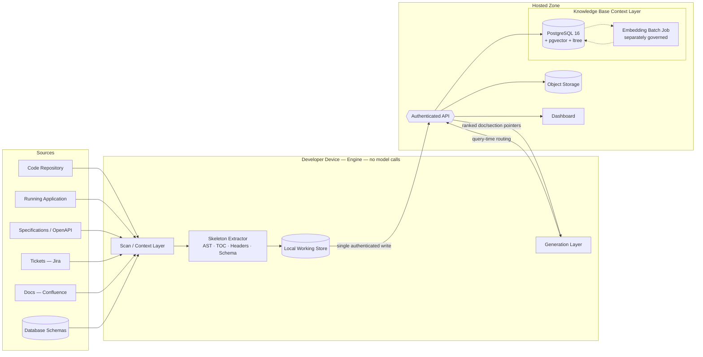
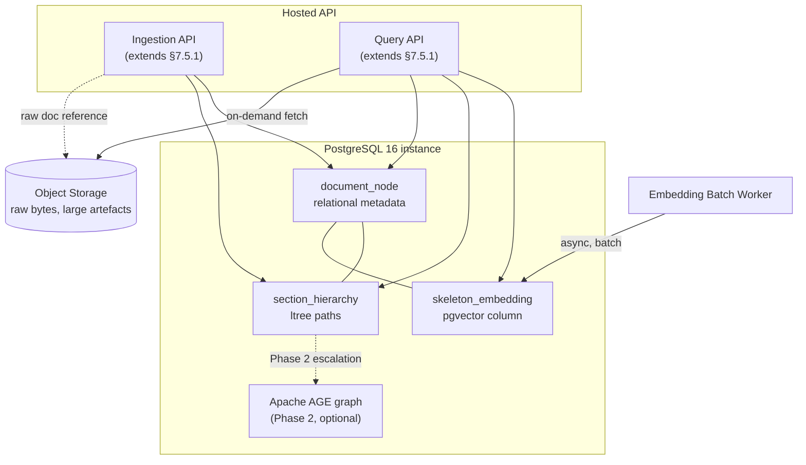
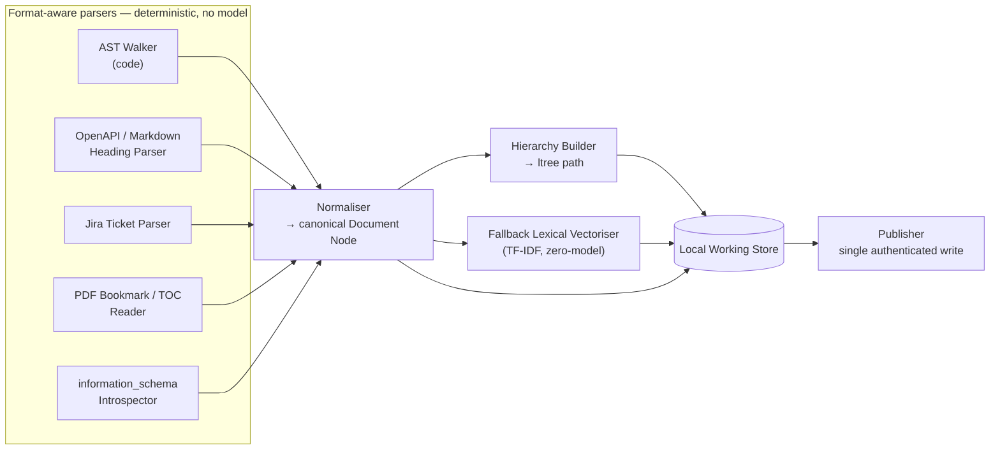
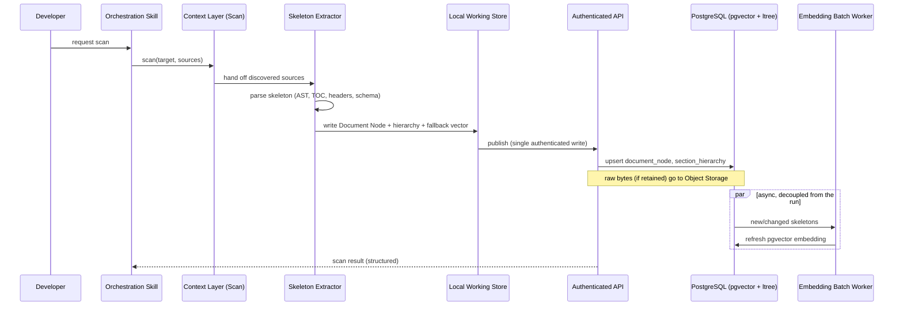
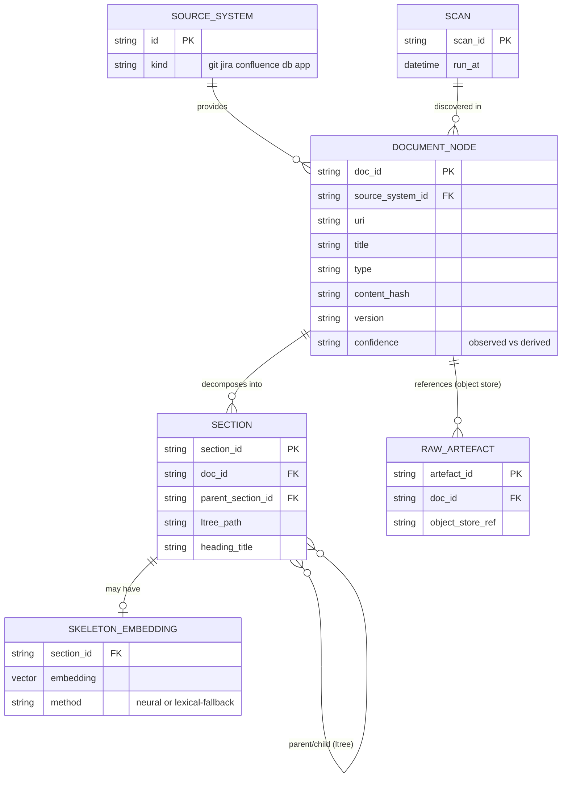
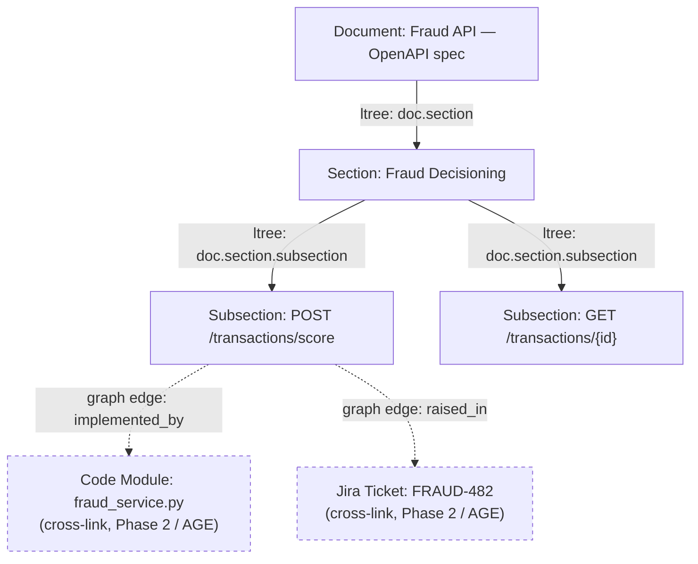

# Knowledge Base Context Layer — Architecture Proposal

**Programme:** AI Test Hook (HSBC Pilot) · **Scope:** Extension to the Context / Knowledge-index capability (SDD §6.1, §7.2) · **Status:** Draft for stakeholder review · **Prepared for:** Knowledge & Interface phase (roadmap, to 15 Oct)

This proposal designs the Knowledge Base Context Layer referenced as an open decision in the Programme Roadmap (p.3, "Knowledge-store technology") and as deferred technical debt in the SDD (§3.4, "Graph store"). It does not introduce a new subsystem — it productionises the **Knowledge indexer** already delivered in the Foundation phase (13 topics, 27 frameworks) into a persisted, queryable store that fits the SDD's existing storage split (§3.3) and Technology Reference Model entries (§8.1).

---

## 1. Approach Analysis — Semantic Skeleton / Structural Metadata Indexing

### 1.1 Formalising the founder's vision

Two approaches were explicitly ruled out:

| Rejected approach | Why it fails the SDD |
|---|---|
| Index full document content | Terabytes of source volume against a ~20-minute scan budget (SDD §2.4) makes full-text indexing a throughput and storage liability, and it re-derives content the engine can fetch on demand anyway. |
| AI "surfing" documents at query time | Directly violates the engine's core design constraint — *"the engine makes no model calls"* (§3.1) — and the cost-control NFR — *"no per-run model spend"* (§2.4). Any design that reads content through a model at run time is out of bounds by definition, not by preference. |

**Semantic Skeleton / Structural Metadata Indexing** is the third path: index the *identity and shape* of a document — its name, source system, table of contents, heading hierarchy, section titles, function/route signatures — never its body. The skeleton is extracted with deterministic parsers (AST walkers, PDF bookmark readers, heading-level regex, `information_schema` introspection), the same class of tool the existing crawler and framework detector already use (SDD §7.2). The result is a **routing index**: given a query, it returns *which* document and *which section* is relevant, not the content itself. Content is fetched on demand, once, only for the sections actually selected — never speculatively, never in bulk.

### 1.2 Why this is the correct fit, not just an acceptable one

| SDD constraint | How the skeleton approach satisfies it |
|---|---|
| Deterministic engine, no model calls at runtime (§3.1, Constraint) | Skeleton extraction is pure parsing — no inference step. It runs in the same class as the existing Context layer's crawl-and-index step. |
| Cost control — no per-run model spend (§2.4) | Indexing cost is O(headers), not O(content); it scales with document *structure*, not document *size*, keeping terabyte-scale corpora inside the existing performance envelope. |
| Portability — self-contained package (§2.4) | No embedding model, tokenizer, or vector library needs to ship inside the device-side engine (see §2.3, Model Boundary). |
| Restricted operation — only target app, configured sources and hosted API are contacted (§2.4) | The skeleton extractor reads configured sources locally; nothing is sent anywhere until the single authenticated publish write, consistent with Figure 1's data flow. |
| "Facts observed directly... take precedence over facts derived" (§6, Data Architecture) | Skeleton records carry a `confidence` / `source_type` field (directly-observed route vs. documentation-derived route) so the existing precedence rule extends cleanly into the KB layer. |
| Knowledge Management business mapping (§5.1.1) — *"Tickets, specifications and documentation are indexed during the scan → Jira; Confluence"* | This proposal is the literal implementation of that existing business-architecture row, not a new capability outside it. |

### 1.3 Where it sits in the existing architecture

The Skeleton Extractor is a new sub-component of the **Context layer** (§7.2), sitting alongside the existing crawler and destructive-write guard. Its output — the skeleton record — replaces the informal "Knowledge index" artefact (§6.1) with a structured, persisted equivalent, published through the same single authenticated write already defined for every other artefact.

---

## 2. Database Strategy — Vector vs. Graph

> **Decision: both — not a choice between them.** We are not picking pgvector *or* a graph engine. We run `pgvector` (similarity search) and `ltree` (structural hierarchy — Postgres's built-in structured-SQL answer to "graph-shaped" queries) **on the single PostgreSQL 16 instance HSBC has already approved**. A dedicated graph engine (`Apache AGE`, still Postgres-hosted) is **not** part of the Phase 1 decision — it's an optional, additive Phase 2 step, taken only if a real multi-hop traversal need shows up later. See §2.3 for the mechanism table and §2.3 "Phasing" for what triggers Phase 2.

### 2.1 Restating the dilemma

Roadmap p.3 records: *"pgvector was proposed in place of Neo4j on licensing grounds. pgvector provides similarity search, not relationship traversal — graph queries need a graph extension or a structured-SQL approach."* The SDD independently confirms this is unresolved: §3.4 lists the graph storage engine as *"not yet selected... deferred pending evaluation"*, and §8.1's TRM table marks it **Emerging / Trial** — the only storage line in the whole architecture without an Approved status.

### 2.2 The factor the roadmap discussion doesn't yet weigh: TRM status

| Technology | HSBC TRM status (SDD §8.1) | Licence | Approval lead-time |
|---|---|---|---|
| PostgreSQL 16 | **Approved / Invest** | PostgreSQL Licence (permissive) | None — already the relational store of record |
| Neo4j (Community) | Not TRM-listed; would enter as new | GPLv3 (copyleft) | New capability onboarding + Risk & Audit review + egress approval |
| Neo4j (Enterprise) | Not TRM-listed; would enter as new | Commercial | Procurement + the above |
| Graph engine, unspecified (§8.1 line item) | **Emerging / Trial** | n/a | Evaluation still open |

The roadmap risk register already flags *"Egress and hosting approval — Long lead times... Raised early"* as High/Medium impact (SDD §3.2). Introducing Neo4j doesn't just cost a licence review — it re-opens a TRM onboarding process against a pilot with a 30 September completion target (SDD cover page) and a 15 October "Knowledge & interface" exit criterion (roadmap p.1). A solution that stays inside an **already-approved** technology avoids that critical-path risk entirely.

### 2.3 Proposed solution: one PostgreSQL 16 instance, three capabilities

Rather than choosing pgvector *or* a graph engine, layer both graph-shaped and vector-shaped access onto the relational store that is already Approved/Invest at HSBC:

| Capability needed | Mechanism | Extension | Licence | New TRM footprint |
|---|---|---|---|---|
| Similarity search (semantic routing) | ANN search (HNSW index) over skeleton embeddings | `pgvector` | PostgreSQL Licence | None — same instance |
| Structural hierarchy (TOC, headings, sections) | Materialised label paths; ancestor/descendant/sibling queries | `ltree` (Postgres contrib, built-in) | PostgreSQL Licence | None — bundled with Postgres |
| Multi-hop relationship traversal (cross-document graph, only if required) | openCypher-style graph queries inside Postgres | `Apache AGE` | Apache 2.0 | None — runs inside the same instance |

This resolves the roadmap's own framing directly: *"graph queries need a graph extension or a structured-SQL approach"* — `ltree` **is** the structured-SQL approach for hierarchy, and `Apache AGE` **is** the graph extension, if and when hierarchy alone stops being enough. Both are optional add-ons to a database HSBC has already approved, not a new database to approve.

**Phasing (avoid paying for graph traversal before it's needed):**

1. **Phase 1 (Knowledge & Interface, to 15 Oct):** `pgvector` + `ltree` only. Covers the founder's stated need — routing by name, TOC, headers, hierarchy — with zero new extensions beyond Postgres contrib.
2. **Phase 2 (Refine & Learn, to 30 Nov, only if triggered):** Add `Apache AGE` if real cross-entity graph queries emerge — e.g. *"which test suites exercise endpoints defined in a spec that a given Jira ticket last touched."* `ltree` cannot express this; a graph traversal can. This is an additive migration, not a replacement.

This directly closes SDD §3.4's technical debt line — *"Graph store: deferred pending evaluation, held behind the API so callers are unaffected"* — because the evaluation outcome is: reuse the approved store, and the caller-facing API contract stated in §7.5.1 (Ingestion API / Query API) does not change either way.

### 2.4 Model boundary — a clarification worth stating explicitly

Semantic similarity search needs *some* embedding to populate the vector column. The SDD's constraint is unambiguous and device-scoped: *"The engine makes no model calls"* (§3.1) and *"the host chat model is the only model in the flow"* (§2.5). This proposal keeps embedding generation **out of the engine entirely**:

- The **device-side engine** only extracts and uploads the structural skeleton (text, no inference).
- The **hosted service** — already a separate governance zone per §7.2 ("Hosted service: API service, web application and three stores") — runs an asynchronous embedding batch job against published skeletons. This is infrastructure-side, amortised, and decoupled from any single run, so it does not create per-run model spend and does not put a model inside "the engine" as the SDD defines it.
- This hosted-side model still needs its own governance sign-off distinct from the IDE host model's existing approval (§2.5, AI and model governance) — flagged below as an open decision, in the same register style as SDD §3.2.
- **Fallback, zero-model option:** if hosted-side embedding approval is not obtained in time, populate the vector column with a deterministic lexical signal instead (TF‑IDF / BM25-style sparse vectors over skeleton tokens, computed with plain arithmetic, no model). `pgvector` stores and queries either representation identically; recall is weaker, but the constraint is met with no exceptions.

| New risk (register style, matching SDD §3.2) | Description & control | Inherent | Residual |
|---|---|---|---|
| Model governance / Embedding | Semantic search needs an embedding step; if run anywhere, it must be hosted-side, batch, and separately approved — never inside the engine. | Medium | Low, with the fallback lexical path as a zero-model contingency |

---

## 3. Data Flow & Ingestion Pipeline

### 3.1 Step-by-step

1. **Discover** *(existing capability)* — the Application crawler and source-extraction components identify sources: code repository, running application, specifications (OpenAPI/Confluence), tickets (Jira), database schemas.
2. **Parse skeleton locally, per source type** *(new — Skeleton Extractor, no model call)*:
   - Code → AST walk for module/class/function signatures and route decorators (extends the existing framework detector).
   - Specifications → operation IDs and section headers (OpenAPI paths, Markdown/Confluence heading tree).
   - Tickets → key, summary, epic/label hierarchy.
   - PDFs → bookmark/TOC entries, with font-size heuristic heading detection as fallback when no TOC exists.
   - Databases → `information_schema` walk for table/column/foreign-key structure.
3. **Normalise** into a canonical Document Node: `{doc_id, source_system, uri, title, type, content_hash, version, section_path[], confidence}`.
4. **Build hierarchy** — persist each section as an `ltree` path (`document.section.subsection`) alongside a parent-reference for direct lookups.
5. **Write locally first** — skeleton, hierarchy, and (if computed via the zero-model fallback) a lexical vector are written to the Local Working Store before anything crosses the device boundary, preserving the existing principle in §6.2.
6. **Publish** — a single authenticated write to the Ingestion API (§7.5.1) delivers the Document Node, its hierarchy path, and any locally-computed vector.
7. **Hosted-side embedding** *(async, batch, separately governed)* — if approved, a background job on the hosted service computes or refreshes the semantic vector, decoupled from any specific run.
8. **Query-time routing** — at the existing **generate** step (sequence flow step 4, SDD §7.4), the Generation layer calls the Query API with a feature/endpoint description. The hosted service runs an ANN search over vectors, filtered/refined by `ltree` hierarchy, and returns a bounded top-K list of `{document, section, path}` pointers.
9. **Targeted fetch** — only the sections actually selected are fetched, once, on demand — this is the routing layer doing its job: pointing the Generation layer at the right three paragraphs out of a 400-page spec, never reading the spec itself into the index.

---

## 4. Architectural Diagrams

### 4.1 High-level overview



### 4.2 HLD — Knowledge Base Context Layer internals



### 4.3 LLD — Skeleton extraction pipeline (device-side)



### 4.4 Sequence — ingestion flow



### 4.5 Sequence — query / routing flow

```mermaid
sequenceDiagram
    participant Gen as Generation Layer
    participant API as Query API
    participant PG as PostgreSQL (pgvector + ltree)
    participant Obj as Object Storage

    Gen->>API: describe feature/endpoint needing context
    API->>PG: ANN search (pgvector) + hierarchy filter (ltree)
    PG-->>API: ranked {document, section, path} pointers, top-K
    API-->>Gen: pointers (no content yet)
    opt only if generator needs the actual text
        Gen->>API: fetch selected section(s)
        API->>Obj: retrieve raw bytes for that section only
        Obj-->>Gen: targeted content
    end
    Note over Gen,Obj: never a full-document read; never a model call in this path
```

### 4.6 Entity-relationship model



### 4.7 Structural hierarchy example (illustrating Phase 2 graph escalation)



Solid edges are `ltree` hierarchy — available from Phase 1. Dashed edges are the cross-entity relationships that would justify introducing `Apache AGE` in Phase 2 — they are not needed to satisfy the founder's stated routing requirement, and are shown to make the escalation trigger concrete rather than abstract.

---

## 5. API Surface (extends SDD §7.5.1)

| Endpoint | Type | Status | Description |
|---|---|---|---|
| `kb.publish` | Ingestion API | Proposed | Accepts a batch of Document Nodes + hierarchy from a scan; idempotent on `content_hash`. |
| `kb.search` | Query API | Proposed | Semantic + hierarchy search; returns ranked `{document, section, path}` pointers, never content. |
| `kb.fetch` | Query API | Proposed | Targeted retrieval of one section's raw content from Object Storage, by pointer. |
| `kb.tree` | Query API | Proposed | Returns the `ltree` subtree for a document — powers a "table of contents" view in the Dashboard. |

These extend, rather than replace, the existing proposed `push`/Ingestion API/Query API surface in §7.5.1 — no change to the already-Available `scan`/`generate`/`execute`/`reports` commands.

---

## 6. Non-Functional & Risk Alignment

| SDD reference | Requirement | This design |
|---|---|---|
| §2.4, Performance | ~20 min scan/generation cycle | Skeleton parsing is structure-bound, not content-bound — adds negligible time to the existing crawl. |
| §2.4, Cost control | No per-run model spend | No model call sits on the engine's critical path; the only model (if used) is an async, hosted, batch job. |
| §2.4, Restricted operation | Engine contacts only target app, configured sources, hosted API | Unchanged — the Skeleton Extractor is a Context-layer sub-component, not a new network actor. |
| §2.4, Data residency | Relational, graph, object stores, all approved | Satisfied by an already-Approved/Invest Postgres instance carrying the graph capability via extension, plus the existing Object store. |
| §3.4, Technical debt — Graph store | "Deferred pending evaluation, held behind the API" | This is the evaluation outcome; the API contract is unaffected either way, exactly as the debt entry anticipated. |
| §8.1, TRM — Graph store: Emerging/Trial | Needs a TRM-defensible path | Reuses PostgreSQL 16 (Approved/Invest); avoids onboarding a net-new, unapproved technology against a fixed pilot deadline. |
| §6, "facts observed... take precedence" | Source-confidence ordering | Carried into `document_node.confidence`, so downstream generation can apply the same precedence rule the SDD already defines. |
| §2.5, AI and model governance | Only the host chat model is pre-approved | Any hosted-side embedding model is flagged here as a new governance item, not silently assumed — see §2.4 above. |

---

## 7. Open Decisions for Stakeholder Sign-off

1. **Embedding governance** — confirm whether a hosted-side batch embedding model can be approved on its own track, or whether Phase 1 should ship with the zero-model lexical fallback only.
2. **Phase 2 trigger** — agree the concrete query pattern(s) that would justify introducing `Apache AGE`, so it isn't added speculatively.
3. **Retention** — raw artefact bytes in Object Storage: confirm lifecycle/retention policy consistent with the existing "bucket per project; lifecycle for retention" decision (SDD §8.1).
4. **Ownership** — this proposal sits under the roadmap's "Knowledge-store technology" item, currently owned by Nikhil / team; confirm this document supersedes that open item pending review.
